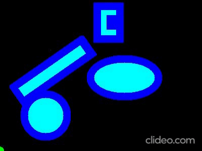

# Path planning for rigid body robots using Dijkstra and AStar algorithms

## ENPM 661 Planning for Autonomous Robots
## Project 3 Phase 1,2

Sakshi Kakde: 117472448           
Siddharth Telang: 116764520       

## Dijkstra Path planning:
### Steps to run:
	python3 Dijkstra_Final.py --InitState 0 0 --GoalState 100 200 --SaveFolderName ./

### Parameters:      

 --InitState: Initial state of the robot     
 --Goal State: Goal state of the robot      
 --SaveFolderName: Folder where the video will be saved (default - current directory)

## A* Path planning:
### Steps to run:
	python3 AStar_Rigid_Body.py --InitState 20 50 90  --GoalState 320 230  --StepSize 10 --SaveFolderName ./

### Parameters:       

 --InitState: Initial state of the robot     
 --Goal State: Goal state of the robot      
 --StepSize: Step size (1-10)      
 --SaveFolderName: Folder where the video will be saved (default - current directory)

## Videos:
https://drive.google.com/drive/folders/10njIiXhTS0WaCclqDIwk8sDQV5vrcUC-?usp=sharing

## Note
If you wish to change the clearance and robot radius, please go to obstacle.py and change the "robot_radius" and "clearance" variable which are set at 5 and 10 as default.

 
